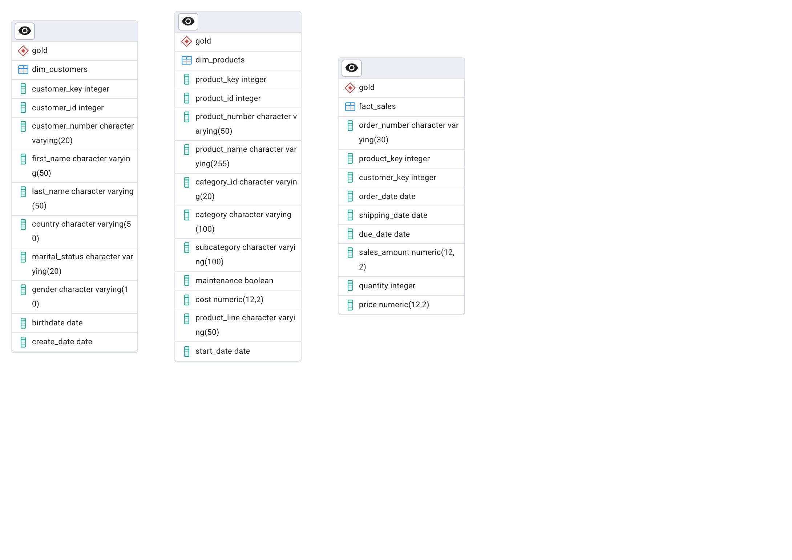

# SQL Data Analytics Project

A SQL-based data analytics project built on **PostgreSQL**, exploring sales data through a star schema (`gold` schema). The project covers a range of analytical techniques — trend analysis, cumulative metrics, segmentation, part-to-whole breakdowns, year-over-year performance, and a consolidated customer report view.

---

## Project Structure

```
sql-data-analytics-project/
│
├── README.md
├── ERD.png
│
├── data/                          -- CSV data files
│   ├── dim_customers.csv
│   ├── dim_products.csv
│   └── fact_sales.csv
│
└── sql/
    ├── 00_schema.sql              -- Database and table definitions
    │
    ├── analysis/
    │   ├── change_over_time.sql   -- Sales trends by day, month, year
    │   ├── cumulative_analysis.sql-- Running totals and running averages
    │   ├── data_segmentation.sql  -- Product cost ranges & customer segments
    │   ├── part_to_whole_analysis.sql -- Category % contribution to total sales
    │   └── performance_analysis.sql   -- Product YoY & vs-average comparisons
    │
    └── views/
        └── report_customer.sql    -- Consolidated customer report (CREATE VIEW)
```

---

## Data Model (Gold Schema)

| Table | Description |
|---|---|
| `gold.dim_customers` | Customer dimension — name, country, gender, birthdate, etc. |
| `gold.dim_products` | Product dimension — name, category, subcategory, cost, product line |
| `gold.fact_sales` | Fact table — one row per order line (order date, sales amount, quantity, price) |

### ERD



---

## Analysis Scripts Overview

| Script | What It Does |
|---|---|
| `change_over_time.sql` | Tracks total sales, unique customers, and quantity sold across different time grains (daily, monthly, yearly, year-month). |
| `cumulative_analysis.sql` | Builds running totals (all-time and year-to-date) and running averages using window functions. |
| `data_segmentation.sql` | Segments products by cost range (Below 100, 100-500, 500-1000, Above 1000) and customers by spend + tenure (VIP, Regular, New). |
| `part_to_whole_analysis.sql` | Calculates each product category's percentage contribution to overall sales. |
| `performance_analysis.sql` | Compares each product's yearly sales against its own multi-year average and prior year (YoY). |
| `report_customer.sql` | Creates a `gold.report_customer` view with customer-level KPIs: age group, segment, recency, AOV, and average monthly spend. |

---

## Getting Started

### Prerequisites

- PostgreSQL 13+
- `psql` CLI available on your PATH

### 1. Create a database

```bash
createdb DataWarehouseAnalytics
```

### 2. Run the schema script

```bash
psql -d DataWarehouseAnalytics -f sql/00_schema.sql
```

### 3. Load the CSV data

Load the CSV files into the tables using `\copy` or any import tool of your choice:

```sql
\copy gold.dim_customers FROM 'data/dim_customers.csv' WITH (FORMAT csv, HEADER true);
\copy gold.dim_products  FROM 'data/dim_products.csv'  WITH (FORMAT csv, HEADER true);
\copy gold.fact_sales    FROM 'data/fact_sales.csv'    WITH (FORMAT csv, HEADER true);
```

### 4. Run any analysis

```bash
psql -d DataWarehouseAnalytics -f sql/analysis/change_over_time.sql
psql -d DataWarehouseAnalytics -f sql/analysis/cumulative_analysis.sql
psql -d DataWarehouseAnalytics -f sql/analysis/part_to_whole_analysis.sql
psql -d DataWarehouseAnalytics -f sql/analysis/performance_analysis.sql
psql -d DataWarehouseAnalytics -f sql/analysis/data_segmentation.sql
```

### 5. Create the customer report view

```bash
psql -d DataWarehouseAnalytics -f sql/views/report_customer.sql
```

Then query it:

```sql
SELECT * FROM gold.report_customer ORDER BY total_sales DESC LIMIT 20;
```

---

## Key SQL Concepts Used

| Concept | Example |
|---|---|
| Aggregation | `SUM()`, `COUNT(DISTINCT ...)`, `AVG()` |
| Date functions | `DATE_TRUNC('month', ...)`, `DATE_PART('year', ...)`, `AGE()` |
| Window functions | `SUM() OVER (ORDER BY ...)`, `AVG() OVER (PARTITION BY ...)`, `LAG()` |
| CTEs | `WITH ... AS (...)` for readable, layered queries |
| CASE expressions | Customer/product segmentation and performance labeling |
| Views | `CREATE VIEW gold.report_customer` for reusable reporting |
